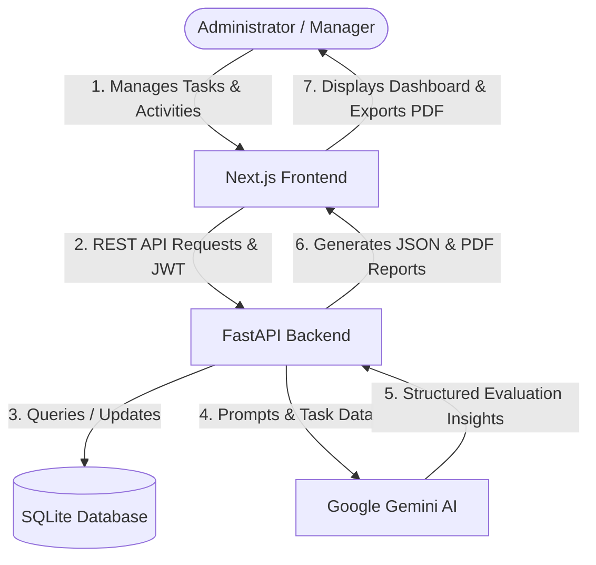

# WIDA AI Workforce Manager

WIDA AI Workforce Manager is an enterprise-grade internal task coordinator, employee activity tracking system, and AI-driven performance evaluation platform. The system is designed to streamline task assignments, log operational activities, and leverage Google Gemini LLM models to generate comprehensive analytics and downloadable evaluation reports.

---

## System Architecture and Workflow

The following flowchart demonstrates the core interaction between the frontend, backend, database, and the Google Gemini AI service.



---

## Core System Features

* **Task Administration:** Allows creation, assignment, and lifecycle management of employee tasks.
* **Activity Tracking:** Monitors employee actions (such as creation, editing, review, and completion) across multiple media types (such as designs, banners, videos, and logos).
* **AI Evaluation Engine:** Integrates Google Gemini API to analyze task metrics and generate professional narrative evaluations.
* **Analytical Dashboard:** Aggregates database records to construct visual productivity and performance charts.
* **Document Export:** Generates structured PDF reports containing evaluation summaries and task telemetry.
* **Security & Authentication:** Implements JWT-based authorization to secure endpoints and restrict operations to verified administrators.

---

## Technical Stack

### Backend Services
* **Application Framework:** FastAPI (Python)
* **Object-Relational Mapping (ORM):** SQLAlchemy
* **Database Engine:** SQLite (Local storage file: wida.db)
* **Artificial Intelligence SDK:** Google GenAI SDK (Gemini API)
* **Security & Cryptography:** PyJWT, Passlib, and Bcrypt

### Frontend Services
* **Application Framework:** Next.js (TypeScript, React 19)
* **Styling Framework:** TailwindCSS v4
* **Iconography:** Lucide React
* **Data Visualization:** Recharts

---

## Directory Structure

```text
AI- Task Eval/
├── backend/
│   ├── app/
│   │   ├── ai/            # Prompt engineering and RAG-based AI evaluation models
│   │   ├── api/           # API Routers (Auth, Tasks, Reports, Dashboard, AI, Settings)
│   │   ├── database/      # Database session and connection setup
│   │   ├── models/        # SQLAlchemy database model definitions
│   │   ├── schemas/       # Pydantic schemas for data validation and serialization
│   │   ├── services/      # Core business logic (auth, reporting, task validation)
│   │   └── main.py        # FastAPI initialization and entry point
│   ├── requirements.txt   # Backend package dependencies
│   └── passenger_wsgi.py  # Production WSGI application gateway
│
└── frontend/
    ├── src/
    │   ├── app/           # Next.js routing and page components
    │   ├── components/    # Reusable UI component modules
    │   └── lib/           # Utility libraries (API clients, PDF generators)
    ├── package.json       # Node package manager configuration
    └── next.config.js     # Next.js compiler settings
```

---

## Installation and Deployment

### System Prerequisites
* Python 3.10 or higher
* Node.js 18 or higher

### Backend Deployment
1. Navigate to the backend directory:
   ```bash
   cd backend
   ```
2. Initialize a Python virtual environment:
   ```bash
   python -m venv venv
   ```
3. Activate the virtual environment:
   * **Windows Command Prompt / PowerShell:**
     ```powershell
     .\venv\Scripts\activate
     ```
   * **macOS / Linux Shell:**
     ```bash
     source venv/bin/activate
     ```
4. Install all backend dependencies:
   ```bash
   pip install -r requirements.txt
   ```
5. Configure environmental parameters. Create a `.env` file inside the `backend/` directory with the following variables:
   ```env
   GEMINI_API_KEY=your_gemini_api_key_here
   SECRET_KEY=your_jwt_secret_key
   ```
6. Start the FastAPI development server:
   ```bash
   uvicorn app.main:app --reload
   ```
   The interactive Swagger documentation is hosted at: `http://127.0.0.1:8000/docs`

### Frontend Deployment
1. Navigate to the frontend directory:
   ```bash
   cd ../frontend
   ```
2. Install the necessary node packages:
   ```bash
   npm install
   ```
3. Initialize the local development server:
   ```bash
   npm run dev
   ```
   Access the application interface at: `http://localhost:3000`

---

## Database Seeding
During application startup, the database structure is evaluated. The backend automatically applies migrations to `wida.db`, registers a default administrator account, and populates database lookup constraints with pre-defined entity classes and operational actions.
