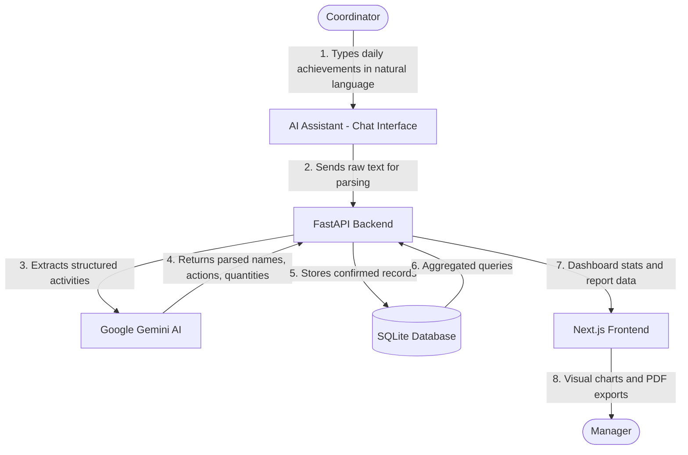

# WIDA ReviewFlow

WIDA ReviewFlow is a specialized internal portal that replaces traditional Excel-based tracking for recording the daily creative output of design and motion graphics teams. A designated coordinator logs each designer's daily achievements through a streamlined interface or an AI-powered natural language assistant. The recorded data is then aggregated into visual dashboards and exportable PDF reports for management review.

---

## System Architecture and Workflow

The following flowchart illustrates the end-to-end data flow from daily input to managerial reporting.



### Typical Daily Input

The coordinator enters achievements in plain Arabic text. The AI assistant parses the input and extracts structured records for confirmation:

```
أحمد 2 تصميم 4 تعديل
خالد تحريك 30 ثانية تعديل 1 دقيقة
عبدالله 2 تصميم 3 تعديل
```

---

## Core Capabilities

* **AI-Powered Input:** A chat-based assistant that accepts natural Arabic text describing daily achievements and automatically extracts employee names, action types, entity types, and quantities using Google Gemini.
* **Daily Achievement Logging:** Records each designer's output (designs created, edits made, animations produced) with date-stamped entries stored in a local database.
* **Employee Registry:** Maintains a list of active designers and animators. Only the coordinator manages this list; designers do not access the system.
* **Analytical Dashboard:** Displays real-time productivity metrics including daily trends, weekly output breakdowns, and top performer rankings through interactive charts.
* **Periodic Reports:** Generates summary and comparison reports (daily, weekly, monthly) with employee-level and entity-level breakdowns.
* **PDF Export:** Compiles recorded activities into formatted PDF documents for offline distribution and archival.
* **Secure Access:** JWT-based authentication restricts all operations to authorized coordinators and managers.

---

## Technical Stack

### Backend Services
* **Application Framework:** FastAPI (Python)
* **Object-Relational Mapping:** SQLAlchemy
* **Database Engine:** SQLite
* **AI Integration:** Google GenAI SDK (Gemini API)
* **Authentication:** PyJWT, Passlib, Bcrypt

### Frontend Services
* **Application Framework:** Next.js (TypeScript, React 19)
* **Styling:** TailwindCSS v4
* **Icons:** Lucide React
* **Charts:** Recharts

---

## Directory Structure

```text
WIDA-ReviewFlow/
├── backend/
│   ├── app/
│   │   ├── ai/            # Gemini prompt engineering and natural language parsing
│   │   ├── api/           # REST API endpoints (Auth, Employees, Activities, Reports, Dashboard, AI, Settings)
│   │   ├── database/      # SQLite database session and initialization
│   │   ├── models/        # SQLAlchemy model definitions (Employee, DailyActivity, EntityType, ActionType)
│   │   ├── schemas/       # Pydantic request and response schemas
│   │   ├── services/      # Business logic (authentication, reporting, activity management)
│   │   └── main.py        # FastAPI application entry point
│   ├── requirements.txt   # Python package dependencies
│   └── passenger_wsgi.py  # Production WSGI gateway
│
└── frontend/
    ├── src/
    │   ├── app/           # Next.js App Router pages (Dashboard, Activities Log, Employees, Assistant, Reports, Settings)
    │   ├── components/    # Reusable layout components (Sidebar, Header)
    │   └── lib/           # Shared utilities (API client, PDF generator, TypeScript type definitions)
    ├── package.json       # Node.js configuration and scripts
    └── next.config.js     # Next.js build settings
```

---

## Installation and Setup

### Prerequisites
* Python 3.10 or higher
* Node.js 18 or higher

### Backend Setup
1. Navigate to the backend directory:
   ```bash
   cd backend
   ```
2. Create and activate a Python virtual environment:
   ```bash
   python -m venv venv
   ```
   * **Windows:**
     ```powershell
     .\venv\Scripts\activate
     ```
   * **macOS / Linux:**
     ```bash
     source venv/bin/activate
     ```
3. Install dependencies:
   ```bash
   pip install -r requirements.txt
   ```
4. Create a `.env` file inside `backend/` with the following variables:
   ```env
   GEMINI_API_KEY=your_gemini_api_key_here
   SECRET_KEY=your_jwt_secret_key
   ```
5. Start the development server:
   ```bash
   uvicorn app.main:app --reload
   ```
   API documentation is available at: `http://127.0.0.1:8000/docs`

### Frontend Setup
1. Navigate to the frontend directory:
   ```bash
   cd ../frontend
   ```
2. Install dependencies:
   ```bash
   npm install
   ```
3. Start the development server:
   ```bash
   npm run dev
   ```
   Open the application at: `http://localhost:3000`

---

## Database Initialization

On first startup, the backend automatically creates the SQLite database file (`wida.db`), registers a default administrator account, and seeds lookup tables with predefined entity types (design, banner, video, animation, etc.) and action types (created, edited, reviewed, completed, etc.).
